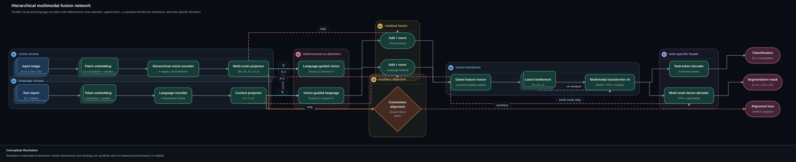
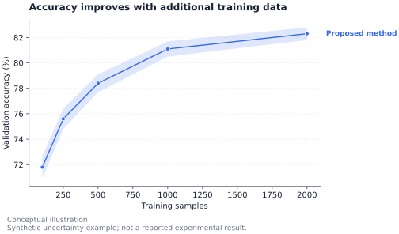
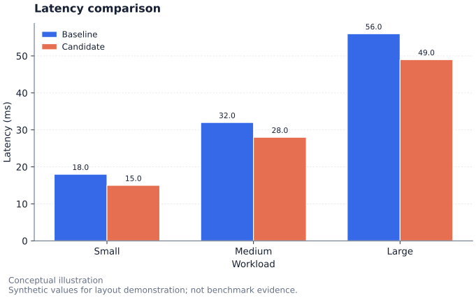
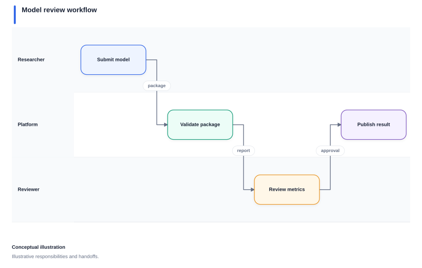

<div align="center">

<picture>
  <source media="(prefers-color-scheme: dark)" srcset="docs/images/figurecraft-wordmark-dark.svg">
  <source media="(prefers-color-scheme: light)" srcset="docs/images/figurecraft-wordmark-light.svg">
  
</picture>

### 用一句提示词生成可发表的科研图表与技术图示

把提示词、数据文件或结构化 FigureSpec 交给 **OpenAI Codex**、**Claude Code**
或 **GitHub Copilot**。FigureCraft 会返回经过校验的图件，以及用于检查、编辑
和复现结果的完整源文件。

[English](README.md) · **简体中文**

[5 分钟开始](#快速开始) · [示例画廊](#示例) · [为什么选择 FigureCraft](#为什么选择-figurecraft) · [文档](#文档)

[](pyproject.toml)
[](LICENSE)
[](https://github.com/Zchary1106/figurecraft/actions/workflows/install-platforms.yml)

</div>

> **它是什么：**一套可移植的 Agent Skill。它能把“可视化这些实验结果”
> 或“梳理这个仓库的架构”这样的请求，转成确定、可审查、可交付的图件。
>
> **它不是什么：**它不是图片生成包装器，也不是托管的在线画布。
> 定量图表由 Matplotlib 渲染；技术图示由 SVG-first 布局与布线路径引擎渲染。

## 一句话输入，可复现输出

下面都是真实的 FigureCraft 输出，而不是展示用 Mockup。主示例包含双模态输入流、
双向交叉注意力、残差融合、重复 Transformer 主干、辅助监督和多个任务输出头。

<p align="center">
  <a href="skills/figurecraft/assets/examples/multimodal-fusion-network.json">
    
  </a>
</p>

<p align="center"><sub><strong>复杂神经网络架构：</strong>点击图件即可查看完整 FigureSpec。</sub></p>

<table>
  <tr>
    <th width="50%">科研图表</th>
    <th width="50%">Agent 系统架构</th>
  </tr>
  <tr>
    <td><a href="skills/figurecraft/assets/examples/uncertainty-band.json"></a></td>
    <td><a href="skills/figurecraft/assets/examples/agent-evidence-workflow.json"></a></td>
  </tr>
  <tr>
    <td>单位、置信区间、图例与数据检查。</td>
    <td>语义角色、路由连线、溯源信息与可编辑 Draw.io。</td>
  </tr>
</table>

## 一眼了解

| 你的需求 | FigureCraft 提供的能力 |
| --- | --- |
| **科研图表** | 折线、柱状、散点、误差线、直方、箱线与热力图，并支持单位、不确定性与数据检查。 |
| **技术图示** | 系统架构、Agent 系统、流程图、泳道图、甘特图、研究框架、系统全景与神经网络图。 |
| **可靠产物** | Schema 校验、实测字体排版、确定性布局、结构化 SVG lint、溯源信息与哈希。 |
| **可用交付** | SVG 源图、可选 PNG/PDF、可编辑 Draw.io、输入 FigureSpec、manifest 与预览页。 |
| **安全迭代** | 可控修订可以保持已确认的几何结构；导出失败不会覆盖此前完整交付。 |

## 快速开始

### 1. 安装到 Codex

克隆仓库，并把 Skills 安装到用户级 Codex Skills 目录。安装器会创建隔离的
Python 运行时并执行就绪检查。

**macOS**

```bash
git clone https://github.com/Zchary1106/figurecraft.git
cd figurecraft
bash ./install.sh --agent codex
```

**Windows PowerShell**

```powershell
git clone https://github.com/Zchary1106/figurecraft.git
cd figurecraft
powershell -NoProfile -ExecutionPolicy Bypass -File .\install.ps1 --agent codex
```

安装完成后，请重启 Codex 或新建一个任务，让它发现新 Skills。

<details>
<summary><strong>安装到 Claude Code、GitHub Copilot、单个项目或升级已有安装</strong></summary>

```bash
# 安装到其他受支持宿主
bash ./install.sh --agent claude      # 也可使用：copilot

# 安装到全部受支持宿主
bash ./install.sh

# 只在一个项目中可用
bash ./install.sh --agent codex --scope project --project "/path/to/project"

# 升级安装；自定义副本会被备份而不是直接覆盖
bash ./install.sh --agent codex --force
```

</details>

### 2. 粘贴一句请求

```text
使用 FigureCraft 检查当前仓库并创建一张面向读者的系统架构图。
只展示主要组件和已经验证的关系。
请交付 FigureSpec、SVG、可编辑 Draw.io 和适合幻灯片的 PNG。
```

或者直接从数据开始：

```text
使用 FigureCraft，根据 results.csv 创建一张双栏科研误差线图。
横轴为 epoch，纵轴为 accuracy，误差值为标准差。
请交付 SVG、300 DPI PNG 和 PDF。
```

Agent 会自动选择合适的专项 Skill。你也可以在请求中明确指定 `figurecraft-charts`、`figurecraft-architecture` 或其他专项名称。

### 3. 检查交付物

一次常规渲染会生成图件、可编辑和可复现所需的源文件，以及本地预览页。

```text
output/
├── figure.svg                 # 主矢量图
├── figure.drawio              # 可编辑图示文件（按请求及图示类型提供）
├── figure.png / figure.pdf    # 可选的最终尺寸导出
├── figure-source.json         # 规范化 FigureSpec
├── figure-manifest.json       # 检查、溯源、哈希和环境元数据
└── index.html                 # 本地预览与交付索引
```

## 为什么选择 FigureCraft

大多数 Agent 绘图流程优化的是“尽快得到一张图片”。FigureCraft 优化的是
“得到一张可以信任、修改和正式交付的图”。

| 工作流 | 快速预览 | 可复现源文件 | 语义校验 | 可编辑矢量图 | 科研检查 |
| --- | :---: | :---: | :---: | :---: | :---: |
| 图片生成提示词 | 是 | 否 | 否 | 否 | 否 |
| 通用图示生成 | 是 | 部分 | 有限 | 部分 | 否 |
| **FigureCraft** | **是** | **FigureSpec** | **是** | **SVG + Draw.io** | **是** |

- **确定性：**相同 FigureSpec 与环境会生成相同布局。
- **可检查：**每次交付都包含规范化源文件、溯源、检查结果、哈希和 Manifest。
- **可编辑：**技术图示可在主 SVG 之外同时交付 Draw.io。
- **适配媒介：**论文、幻灯片、网页和海报使用明确的尺寸与排版约束。
- **失败关闭：**数据语义错误、字体缺字、Lint 失败或导出损坏时，不会静默覆盖
  上一次有效交付。

## 示例

下方每张图都由仓库内已提交的 FigureSpec 生成。横向结构会使用整行宽度展示，
确保张量尺寸、重复模块、残差路径与连线语义保持可读。

### 神经网络架构图板

<p align="center">
  <a href="skills/figurecraft/assets/examples/cnn-architecture.json">
    
  </a>
</p>

该图完整展示宏观计算路径、准确张量日程、重复阶段、下采样变化、代表性瓶颈模块、
投影捷径以及用于理解模型的视觉语法。

### 更多图件类型

<table>
  <tr>
    <th width="50%">密集系统全景</th>
    <th width="50%">研究框架</th>
  </tr>
  <tr>
    <td><a href="skills/figurecraft/assets/examples/system-landscape.json"></a></td>
    <td><a href="skills/figurecraft/assets/examples/research-framework.json"></a></td>
  </tr>
  <tr>
    <th>科研对比图</th>
    <th>角色流程图</th>
  </tr>
  <tr>
    <td><a href="skills/figurecraft/assets/examples/bar-comparison.json"></a></td>
    <td><a href="skills/figurecraft/assets/examples/swimlane.json"></a></td>
  </tr>
</table>

全部已提交的输入文件位于 [`skills/figurecraft/assets/examples/`](skills/figurecraft/assets/examples/)。

## 选择合适的专项 Skill

| Skill | 最适合的场景 |
| --- | --- |
| [`figurecraft`](skills/figurecraft/SKILL.md) | 共享 FigureSpec 工作流、渲染、导出、校验与交付。 |
| [`figurecraft-charts`](skills/figurecraft-charts/SKILL.md) | 科研图表、坐标轴、单位、不确定性、标注与数据校验。 |
| [`figurecraft-architecture`](skills/figurecraft-architecture/SKILL.md) | 软件架构、系统全景、Agent 系统、接口与协议。 |
| [`figurecraft-neural-networks`](skills/figurecraft-neural-networks/SKILL.md) | 神经网络拓扑、张量形状、CNN 阶段、残差路径与模型图板。 |
| [`figurecraft-research-frameworks`](skills/figurecraft-research-frameworks/SKILL.md) | 研究方法、证据链、效度和多工作流研究框架矩阵。 |
| [`figurecraft-process-diagrams`](skills/figurecraft-process-diagrams/SKILL.md) | 流程图、算法图、泳道图与甘特图。 |
| [`figurecraft-visual-critic`](skills/figurecraft-visual-critic/SKILL.md) | 审查并改进信息层级、排版、连线、配色与可读性。 |

## 工作原理

[](skills/figurecraft/assets/examples/how-it-works.json)

FigureCraft 以 `FigureSpec` 为唯一事实来源。它记录内容、语义、输出格式、语言、最终尺寸介质、布局选项和溯源信息。相比只有位图的流程，这使图件更易复现、审查和安全地修订。

## 输出格式与依赖

| 输出 | 适用场景 | 依赖 |
| --- | --- | --- |
| **SVG** | 主矢量输出和技术图示 | 默认包含。 |
| **Draw.io** | 手动编辑已支持的技术图示 | 为受支持的技术图示类型默认生成。 |
| **PNG / PDF** | 论文、幻灯片与位图工作流 | 图表使用 Matplotlib；图示转换需要原生 Cairo。 |

使用中文标签时，请安装 CJK 字体，例如 PingFang SC、Microsoft YaHei 或 Noto Sans CJK SC。SVG 与 Draw.io 图示不依赖原生 Cairo。如需在安装时强制验证全部导出格式：

```bash
bash ./install.sh --require-export
```

在 macOS 上可使用以下命令安装图示导出依赖：

```bash
brew install cairo
```

关于运行时诊断、受支持的动态库路径、Windows 安装和安全升级，请阅读[安装与运行时就绪说明](skills/figurecraft/references/installation.md)。

## 直接使用 CLI

Agent 是标准使用路径；在 CI 或本地开发中，也可以直接调用 CLI。

```bash
# 检查某个目标渲染管线的运行环境
python3 skills/figurecraft/scripts/figure.py check-env \
  --format png --kind diagram.architecture --cjk

# 不渲染，只校验 FigureSpec
python3 skills/figurecraft/scripts/figure.py validate \
  skills/figurecraft/assets/examples/line-chart.json

# 渲染一张图
python3 skills/figurecraft/scripts/figure.py render \
  skills/figurecraft/assets/examples/agent-evidence-workflow.json \
  --output output/agent-evidence-workflow

# 渲染关联的总览/详情图组
python3 skills/figurecraft/scripts/figure.py render-set \
  skills/figurecraft/assets/examples/framework-matrix.json \
  --output output/framework
```

## 可靠性与边界

FigureCraft 的目标是让正确的工作流更容易实现，而不是宣称取代所有编辑判断。

- 渲染前会校验数值、单位、不确定性语义、甘特图依赖、声明的网络维度和 FigureSpec 结构。
- 文本会以已安装的 FreeType 字体实测；遇到缺字或无法容纳的布局会报告问题，而非静默裁切。
- 渲染采用事务化发布：导出或 lint 失败时会保留此前完整的交付物。
- 极其密集的图示仍可能需要拆分、增加详情图或由人类进行视觉审查。
- 在 Draw.io 中手动编辑的修改不会自动回写到 FigureSpec。
- 参考图片用于提取布局和视觉语言，不会按像素复制原始作品。

## 文档

- [贡献指南](CONTRIBUTING.md)
- [FigureSpec 参考](skills/figurecraft/references/figure-spec.md)
- [安装与运行时就绪](skills/figurecraft/references/installation.md)
- [科研图表指南](skills/figurecraft/references/scientific-charts.md)
- [技术图示指南](skills/figurecraft/references/technical-diagrams.md)
- [论文与幻灯片的最终尺寸输出](skills/figurecraft/references/output-media.md)
- [可控修订](skills/figurecraft/references/controlled-edits.md)
- [语言与溯源](skills/figurecraft/references/language-and-provenance.md)
- [参考图蒸馏](skills/figurecraft/references/reference-distillation.md)
- [视觉审查量表](skills/figurecraft/references/critique-rubric.md)

新贡献者可以从真实场景 FigureSpec 示例、安装诊断，或排版、路由、校验和导出的
回归测试开始。请使用仓库 Issue 模板报告可复现问题或提出新的图件类型。

## 开发

```bash
python3 -m venv .venv
.venv/bin/python -m pip install -e ".[export]"

# 运行完整测试集
.venv/bin/python -m unittest discover -s tests -v

# 校验全部内置示例
for spec in skills/figurecraft/assets/examples/*.json; do
  .venv/bin/python skills/figurecraft/scripts/figure.py validate "$spec"
done
```

若 macOS 的 Python 无法发现 Homebrew 安装的 Cairo，请在运行导出测试时设置：

```bash
DYLD_FALLBACK_LIBRARY_PATH=/opt/homebrew/lib \
  .venv/bin/python -m unittest discover -s tests -v
```

## 仓库结构

```text
.
├── install.py / install.sh / install.ps1  跨平台安装程序
├── skills/                                 核心与六个专项 Skill
│   └── figurecraft/                        渲染器、Schema、示例、主题和参考文档
├── docs/images/                            已提交的示例输出与项目图标
├── tests/                                  渲染、安装、导出和安全性回归测试
└── .github/workflows/                      跨平台安装检查
```

## 许可证

[MIT License](LICENSE)
